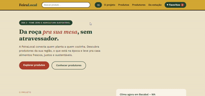

# 🌱 FeiraLocal

Plataforma web que conecta pequenos produtores da agricultura familiar a
consumidores, facilitando o acesso a alimentos frescos, locais e da estação
— sem atravessadores, com o pedido finalizado diretamente com o produtor
via WhatsApp.

Projeto acadêmico desenvolvido para a disciplina **Desenvolvimento Web**
(UEMA/Uemanet), ligado ao **ODS 2 — Fome Zero e Agricultura Sustentável**
da Agenda 2030 da ONU.

<p align="center">
  
</p>

## 📌 Sobre o projeto

Muitos produtores familiares têm dificuldade para vender diretamente ao
consumidor, dependendo de intermediários que reduzem sua renda. A
FeiraLocal propõe encurtar essa distância, dando visibilidade a produtores
locais e permitindo que o próprio consumidor finalize a compra em contato
direto com quem produziu — um modelo pensado para funcionar bem mesmo em
contextos rurais, onde o WhatsApp já é o canal de comunicação mais comum.

## 🧭 Funcionalidades

- Catálogo de produtos com **busca** (no cabeçalho, disponível em qualquer
  página) e **filtro por categoria**
- **Perfil de cada produtor**, com descrição, localização e todos os
  produtos que ele vende (nome do produtor é clicável em qualquer lugar do
  site)
- Botão de **contato direto** com o produtor pelo WhatsApp, para quem quer
  só tirar uma dúvida antes de comprar
- **Carrinho de compras**, com os itens automaticamente **agrupados por
  produtor** — se você adicionar produtos de gente diferente, o carrinho
  organiza em blocos, cada um com seu próprio botão de finalizar pedido
- **Checkout via WhatsApp**: ao comprar, o cliente é redirecionado para uma
  conversa já com a lista de produtos e quantidades escrita na mensagem
- **Sistema de favoritos**, com página própria e persistência entre sessões
  (`localStorage`)
- **Alimentos da estação** com seletor de mês, trocando o conteúdo exibido
- Widget de **clima em tempo real** (API pública Open-Meteo)
- **Painel de impacto** com números animados
- Layout responsivo (desktop, tablet e celular)

## 🛠️ Tecnologias

- **React 18** + **Vite**
- **React Router DOM** — roteamento client-side (SPA)
- **Context API** — estado global (favoritos, busca e carrinho)
- **Fetch API + JSON** — consumo de dados internos (produtos/produtores) e
  de uma API pública externa (clima)
- **CSS3** — Grid, Flexbox e Media Queries, sem framework de estilos

## 📁 Estrutura

```
feiralocal-react/
├── index.html
├── package.json
├── vite.config.js
├── public/
│   └── data/
│       ├── produtos.json
│       └── produtores.json
└── src/
    ├── main.jsx
    ├── App.jsx
    ├── index.css
    ├── config.js
    ├── context/
    │   ├── FavoritesContext.jsx
    │   ├── SearchContext.jsx
    │   └── CartContext.jsx
    ├── components/
    │   ├── Header.jsx
    │   ├── Hero.jsx
    │   ├── Sobre.jsx
    │   ├── Clima.jsx
    │   ├── Produtos.jsx
    │   ├── ProductCard.jsx
    │   ├── Produtores.jsx
    │   ├── Estacao.jsx
    │   ├── Sustentabilidade.jsx
    │   ├── Impacto.jsx
    │   ├── CartModal.jsx
    │   ├── ScrollToHash.jsx
    │   └── Footer.jsx
    └── pages/
        ├── Home.jsx
        ├── Favoritos.jsx
        └── ProdutorPerfil.jsx
```

Todo o código está comentado, explicando o porquê das principais decisões
(por que cada estado é local ou global, por que certos dados vêm de fetch e
outros não, etc.).

## ▶️ Como rodar localmente

É necessário ter o [Node.js](https://nodejs.org) instalado (versão 18 ou
superior).

```bash
git clone https://github.com/JairoDias22/Feira-local.git
cd Feira-local
npm install
npm run dev
```

O terminal vai mostrar um endereço local (algo como
`http://localhost:5173`) — abra no navegador.

Para gerar a versão de produção (usada na publicação):

```bash
npm run build
```

Isso cria uma pasta `dist/` com os arquivos finais, prontos para hospedagem.

### Configurando o WhatsApp

Antes de usar o carrinho e o contato com produtores, configure os números
reais:

- `src/config.js` — número padrão de fallback
- `public/data/produtores.json` — número de cada produtor (campo `whatsapp`)

Formato: código do país + DDD + número, só dígitos (ex: `5598912345678`).

## 🌐 Publicação

Aplicação publicada com [Vercel](https://vercel.com), a partir deste
repositório (deploy automático a cada `git push` na branch `main`).

## 👥 Equipe

- Jairo Dias
- João Marcos

## 🎯 ODS relacionado

**ODS 2 — Fome Zero e Agricultura Sustentável**

---

Projeto desenvolvido para fins acadêmicos — Universidade Estadual do
Maranhão (UEMA/Uemanet).
